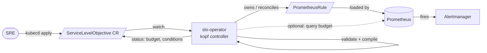

# slo-operator

[](https://github.com/charanvamsy26/slo-operator/actions/workflows/ci.yaml)
[](https://github.com/charanvamsy26/slo-operator/actions/workflows/codeql.yaml)
[](LICENSE)
[](pyproject.toml)

A Kubernetes **operator** (built with [kopf](https://kopf.readthedocs.io)) that turns a single
declarative `ServiceLevelObjective` custom resource into the full set of Prometheus
**SLI recording rules** and **multi-window, multi-burn-rate (MWMB) alerts** described in the
[Google SRE Workbook](https://sre.google/workbook/alerting-on-slos/) — and reports live
**error-budget** consumption back into the resource's status.

You declare *intent* ("`demo-api` should be 99.9% available over 30 days"); the operator owns the
tedious, error-prone PromQL: seven rate windows, four burn-rate alert tiers, the budget arithmetic,
and keeping the generated `PrometheusRule` in sync as the objective changes.

```yaml
apiVersion: sre.charanvamsy.dev/v1alpha1
kind: ServiceLevelObjective
metadata:
  name: demo-api-availability
  namespace: demo
spec:
  service: demo-api
  objective: 99.9          # target success % over the window
  window: 30d
  sli:
    events:
      errorQuery: sum(rate(http_requests_total{service="demo-api",status=~"5.."}[{{.window}}]))
      totalQuery: sum(rate(http_requests_total{service="demo-api"}[{{.window}}]))
  alerting:
    pageLabels:   { severity: critical }
    ticketLabels: { severity: warning }
```

```console
$ kubectl get slo -A
NAMESPACE   NAME                    SERVICE    OBJECTIVE   WINDOW   BUDGET %   READY   AGE
demo        demo-api-availability   demo-api   99.9        30d      87.34      True    2m
```

---

## Why this exists

Hand-writing burn-rate alerts is a classic source of pager pain: people copy a snippet, fat-finger a
threshold, forget a window, and end up with alerts that either never fire or page on every blip.
This operator makes the SLO the **single source of truth** and compiles it deterministically, so the
same objective always produces the same, correct rules. It is the natural companion to the
hand-rolled SLO rules in my [`eks-gitops-platform`](https://github.com/charanvamsy26/eks-gitops-platform)
— here those rules are *generated and reconciled* instead of copy-pasted.

## Architecture



1. **Watch** — kopf watches `ServiceLevelObjective` resources cluster-wide (or in selected namespaces).
2. **Validate** — the spec is checked (objective in `(0,100)`, supported window, queries contain the
   `{{.window}}` placeholder); invalid specs get an `InvalidSpec` event and a `Ready=False` condition
   instead of crash-looping.
3. **Compile** — a pure function ([`compiler.py`](src/slo_operator/compiler.py)) turns the spec into a
   `PrometheusRule` manifest. Identical input → byte-identical output, so reconciles never churn rules.
4. **Apply** — the `PrometheusRule` is created/updated and set as an **owned child** (owner reference),
   so it is garbage-collected automatically when the SLO is deleted.
5. **Report** — when configured with `--prometheus-url`, a timer queries the live error ratio and writes
   `remainingPercent` / `burnRate` into `.status.errorBudget`.

## What gets generated

For `objective: 99.9` (allowed error ratio = `0.001`) the operator emits two rule groups:

**Recording rules** — the error ratio over each window the alerts need:

| record | window |
| --- | --- |
| `slo:sli_error:ratio_rate5m` … `ratio_rate3d` | 5m, 30m, 1h, 2h, 6h, 1d, 3d |

**Multi-window multi-burn-rate alerts** — one alert (`SLOErrorBudgetBurn`) per tier, firing only when
*both* the long and short windows breach the threshold:

| Severity | Long / Short | Burn factor | Threshold (99.9%) | Budget burned |
| --- | --- | --- | --- | --- |
| page   | 1h / 5m  | 14.4× | `0.0144`  | ~2% in 1h |
| page   | 6h / 30m | 6×    | `0.006`   | ~5% in 6h |
| ticket | 1d / 2h  | 3×    | `0.003`   | ~10% in 1d |
| ticket | 3d / 6h  | 1×    | `0.001`   | ~10% in 3d |

See [docs/architecture.md](docs/architecture.md) for the generated YAML and the math.

## Install

> Requires the [Prometheus Operator](https://github.com/prometheus-operator/prometheus-operator)
> CRDs (for `PrometheusRule`) — e.g. via the `kube-prometheus-stack` chart.

### Helm (recommended)

```bash
helm install slo-operator ./charts/slo-operator \
  --namespace slo-system --create-namespace \
  --set prometheus.url=http://prometheus-operated.monitoring.svc:9090 \
  --set prometheusRuleLabels.release=kube-prometheus-stack
```

`prometheusRuleLabels` should match your Prometheus's `ruleSelector` so the generated rules are
discovered. `prometheus.url` is optional and only enables error-budget reporting.

### kubectl / kustomize

```bash
kubectl apply -k config/         # CRD + RBAC + Deployment into namespace slo-system
kubectl apply -f config/samples/servicelevelobjective.yaml
```

## Configuration

| Flag | Env | Default | Description |
| --- | --- | --- | --- |
| `--prometheus-url` | `SLO_PROMETHEUS_URL` | _(off)_ | Prometheus endpoint for live error-budget reporting |
| `--prometheusrule-labels` | `SLO_PROMETHEUSRULE_LABELS` | _(none)_ | `k=v,k2=v2` labels added to generated `PrometheusRule`s |
| `--budget-interval` | `SLO_BUDGET_INTERVAL_SECONDS` | `300` | Seconds between budget evaluations |
| `--namespace` (repeatable) | — | all | Namespaces to watch |
| `--liveness` | `SLO_LIVENESS_ENDPOINT` | `:8080/healthz` | kopf liveness endpoint |

## Development

```bash
make venv     # create .venv and install with dev extras
make lint     # ruff
make test     # pytest
make run      # run the operator against your current kube-context
```

The logic that matters — rule compilation, burn-rate windows, and budget math — is pure Python with
no cluster dependency, so the test suite runs in well under a second:

```console
$ make test
36 passed in 0.15s
```

## Project layout

```
src/slo_operator/
  operator.py     kopf handlers: reconcile / delete / budget timer
  compiler.py     pure SLO-spec -> PrometheusRule compiler
  windows.py      Google SRE workbook burn-rate window tables
  budget.py       error-budget math
  validation.py   spec validation + normalization
  prometheus.py   minimal Prometheus query client
  query.py        {{.window}} template rendering
config/           CRD, RBAC, Deployment, samples (kustomize)
charts/           Helm chart
tests/            pytest suite (pure-logic, no cluster needed)
```

## Roadmap

- Latency / distribution SLIs (histogram quantile targets) in addition to event ratios.
- Configurable windows beyond `30d` (7d, 90d).
- A validating admission webhook (today validation happens in the reconcile handler).
- Grafana SLO dashboard generation.

## License

[Apache 2.0](LICENSE) © 2026 Guru Charan Vamsy Vardhineedi
