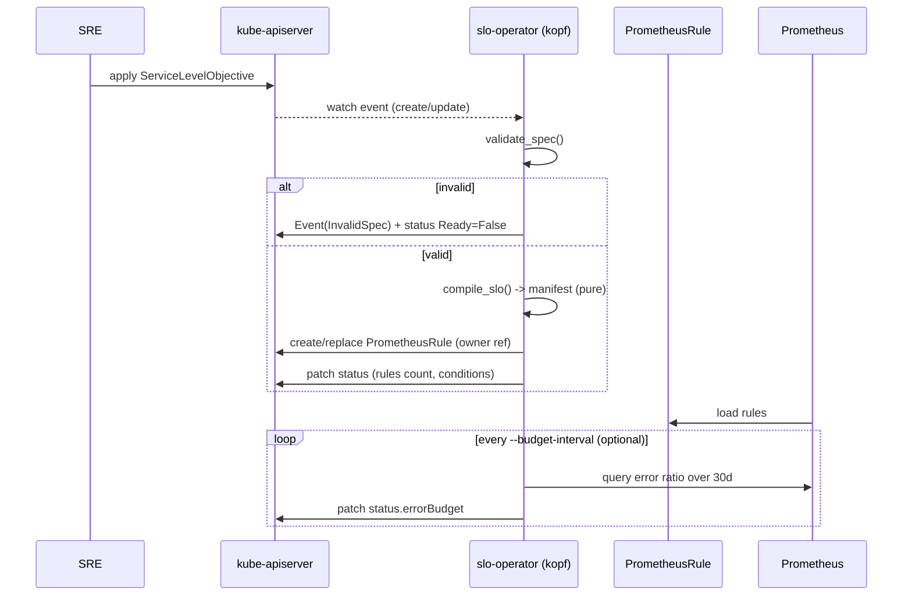

# Architecture & design

This document explains how `slo-operator` compiles a `ServiceLevelObjective` into Prometheus rules,
the burn-rate math behind it, and the design decisions worth knowing.

## The reconcile loop



The compiler is deliberately a **pure function**: `compile_slo(name, namespace, spec) -> manifest`.
No Kubernetes calls, no clock, no randomness. That gives two properties:

- **Idempotent reconciles.** Identical spec → byte-identical manifest → no needless `PrometheusRule`
  churn (which would otherwise reload Prometheus and reset `for:` timers).
- **Exhaustive unit tests.** The hard logic is tested without a cluster (see [`tests/`](../tests)).

## Burn-rate math

For an objective `O` (e.g. `99.9`), the **allowed error ratio** is:

```
allowed = 1 - O/100          # 99.9 -> 0.001
```

A burn-rate **factor** `f` means "burning budget `f`× faster than sustainable." An alert at factor
`f` compares the observed error ratio against:

```
threshold = f * allowed       # f=14.4, O=99.9 -> 0.0144
```

The four tiers come straight from the SRE workbook for a 30-day window:

| Severity | Long / Short | factor `f` | threshold @ 99.9% | budget consumed |
| --- | --- | --- | --- | --- |
| page   | 1h / 5m  | 14.4 | 0.0144 | ~2% of budget in 1h |
| page   | 6h / 30m | 6    | 0.006  | ~5% of budget in 6h |
| ticket | 1d / 2h  | 3    | 0.003  | ~10% of budget in 1d |
| ticket | 3d / 6h  | 1    | 0.001  | ~10% of budget in 3d |

Each alert requires **both** windows to breach, which keeps fast detection (short window) while
avoiding flaps after an incident ends (long window). The error-budget status is:

```
burn_rate          = error_ratio / allowed
remaining_percent  = (1 - error_ratio/allowed) * 100   # negative once breached
```

## Generated output

A 99.9% availability SLO compiles to **7 recording rules** + **4 alerts**. Samples:

### Recording rule (1h window)

```yaml
- record: slo:sli_error:ratio_rate1h
  expr: |
    (
      sum(rate(http_requests_total{service="demo-api",status=~"5.."}[1h]))
    )
    /
    (
      sum(rate(http_requests_total{service="demo-api"}[1h]))
    )
  labels:
    sre_service: demo-api
    sre_slo: demo-api-availability
```

### Page alert (fast burn, 1h/5m, 14.4×)

```yaml
- alert: SLOErrorBudgetBurn
  expr: |
    (
      slo:sli_error:ratio_rate1h{sre_service="demo-api",sre_slo="demo-api-availability"} > 0.0144
      and
      slo:sli_error:ratio_rate5m{sre_service="demo-api",sre_slo="demo-api-availability"} > 0.0144
    )
  for: 2m
  labels:
    sre_service: demo-api
    sre_slo: demo-api-availability
    sre_severity: page
    sre_long_window: 1h
    sre_short_window: 5m
    severity: critical
  annotations:
    summary: SLO demo-api-availability (demo-api) is burning its error budget
    description: demo-api burn-rate over 1h/5m exceeds 14.4x, consuming ~2% of the 30d error budget. Objective is 99.9%.
```

### Ticket alert (slow burn, 3d/6h, 1×)

```yaml
- alert: SLOErrorBudgetBurn
  expr: |
    (
      slo:sli_error:ratio_rate3d{sre_service="demo-api",sre_slo="demo-api-availability"} > 0.001
      and
      slo:sli_error:ratio_rate6h{sre_service="demo-api",sre_slo="demo-api-availability"} > 0.001
    )
  for: 15m
  labels:
    sre_severity: ticket
    severity: warning
    # ...identity + window labels omitted for brevity
```

## Design decisions

- **Owner references over finalizers for cleanup.** The `PrometheusRule` is an owned child, so
  Kubernetes garbage-collects it when the SLO is deleted. The explicit `on.delete` handler is a
  belt-and-braces cleanup that also emits an Event — but correctness does not depend on it.
- **Query templates with `{{.window}}`.** Users write the SLI numerator/denominator once; the operator
  substitutes each rate window. Validation rejects queries missing the placeholder, so a common
  copy-paste mistake fails fast with a clear message rather than producing silently-wrong rules.
- **Validation in the handler, not (yet) a webhook.** The CRD's OpenAPI schema covers structure and
  bounds; semantic checks live in `validate_spec`. A failed validation produces a `Ready=False`
  condition and an Event instead of a crash loop. An admission webhook is on the roadmap.
- **Stable, sorted label matchers.** Matchers are rendered with sorted keys so output is deterministic
  across reconciles and Python dict ordering can never cause spurious diffs.
- **Standalone kopf (no peering).** The operator runs without a `ClusterKopfPeering` CRD, keeping RBAC
  minimal; run a single replica (leader-election-style peering is unnecessary at this scope).
